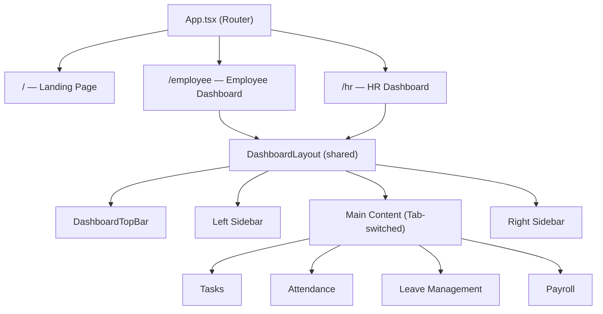

# Employee & HR Dashboard Pages — Implementation Plan

Build two full dashboard pages (Employee + HR) following the existing Sentinel AI dark design system, with a GitHub-inspired 3-column layout, Discord-like group chats, a GitHub-style contribution tree, full attendance/leave/payroll management, and shared UI patterns.

## User Review Required

> [!IMPORTANT]
> **Routing Strategy**: We will install `react-router-dom` and convert `App.tsx` into a router. The landing page (Hero + Login) will remain at `/`, while the dashboards will live at `/employee` and `/hr`. The LoginBox will navigate to the correct dashboard on form submit.

> [!IMPORTANT]
> **Mock Data Only**: All data (employees, tasks, chats, attendance, leave requests, payroll) will be hardcoded mock data with `useState` for interactivity. No backend or API integration. This gives you a fully interactive, visual prototype that can be wired to a real backend later.

> [!WARNING]
> **No Spline 3D on Dashboards**: The heavy Spline 3D scene will only load on the landing page. Dashboard pages use the same dark color palette but with a clean, performant layout — no 3D background.

## Open Questions

> [!IMPORTANT]
> **Logo Text**: The navbar currently says "Xellotape". On the dashboard pages, should the top-left still say "Xellotape" or should it say "SENTINEL AI"? The plan assumes "SENTINEL AI" with the green accent for the dashboard, and clicking it navigates home.

> [!NOTE]
> **Chat Functionality**: Discord-like chats will be UI-only (message list + input box). No real-time messaging. Is that acceptable for this phase?

---

## Architecture Overview



### File Structure (all new files)

```
HR-m-ai/
├── components/
│   ├── layout/
│   │   ├── DashboardLayout.tsx         ← Shared 3-col GitHub-like shell
│   │   ├── DashboardTopBar.tsx         ← Top bar with logo + profile
│   │   └── DashboardSidebar.tsx        ← Left sidebar container
│   ├── shared/
│   │   ├── ContributionTree.tsx        ← GitHub-style green pixel grid
│   │   ├── ChatPanel.tsx               ← Discord-style chat UI
│   │   ├── ProfileDropdown.tsx         ← Top-right profile menu
│   │   ├── TaskCard.tsx                ← Reusable task card component
│   │   ├── CalendarPicker.tsx          ← Monthly calendar for attendance & leave
│   │   └── MonthlyCalendarView.tsx     ← Calendar grid with day-status markers
│   ├── employee/
│   │   ├── EmployeeDashboard.tsx       ← Main employee page (tab router)
│   │   ├── EmployeeSidebar.tsx         ← Left: HR contacts, chats, projects
│   │   ├── TaskSection.tsx             ← Center: task list + upload
│   │   ├── ProgressReport.tsx          ← Right: small progress widget
│   │   ├── HRContactDropdown.tsx       ← Dropdown for HR department contacts
│   │   ├── EmployeeAttendance.tsx      ← Check-in/out + own attendance view
│   │   ├── EmployeeLeave.tsx           ← Apply for leave with calendar picker
│   │   └── EmployeePayroll.tsx         ← Read-only payroll/salary view
│   └── hr/
│       ├── HRDashboard.tsx             ← Main HR page (tab router)
│       ├── HRSidebar.tsx               ← Left: employee list, contacts
│       ├── EmployeeList.tsx            ← Employee cards with switcher
│       ├── HRAttendanceRecords.tsx     ← All-employee attendance management
│       ├── HRLeaveApprovals.tsx        ← Leave request approval workflow
│       └── HRPayrollControl.tsx        ← Full payroll management + salary updates
├── data/
│   └── mockData.ts                     ← All mock data in one place
```

---

## Proposed Changes

### 1. Dependencies & Config

#### [MODIFY] [package.json](file:///c:/Users/Sudipto%20Haldar/Desktop/HR-m-ai/package.json)
- Add `react-router-dom` dependency for client-side routing

#### [MODIFY] [tailwind.config.ts](file:///c:/Users/Sudipto%20Haldar/Desktop/HR-m-ai/tailwind.config.ts)
- Add new keyframes: `slide-in-left`, `slide-down`, `pulse-green` for sidebar and dropdown animations
- Add new color tokens: `--card`, `--card-foreground`, `--sidebar`, `--chat-bg` for dashboard-specific surfaces
- Extend content paths to include `./components/**/*.{ts,tsx}`

#### [MODIFY] [index.css](file:///c:/Users/Sudipto%20Haldar/Desktop/HR-m-ai/index.css)
- Add new CSS custom properties for dashboard surfaces:
  - `--card: 0 0% 13%` (slightly lighter than background for card surfaces)
  - `--card-foreground: 0 0% 96%`
  - `--sidebar: 0 0% 11%` (between hero-bg and background)
  - `--chat-bg: 0 0% 12%` (Discord-like dark chat background)
- Add custom scrollbar styles (thin, dark, matching theme)
- Add `.contribution-cell` utility classes for the green pixel grid
- Add calendar-specific styles for attendance/leave day cells

---

### 2. Routing & App Shell

#### [MODIFY] [App.tsx](file:///c:/Users/Sudipto%20Haldar/Desktop/HR-m-ai/App.tsx)
- Wrap in `BrowserRouter` from react-router-dom
- Add `Routes` with three paths:
  - `/` → Landing page (current Navbar + HeroSection)
  - `/employee` → EmployeeDashboard
  - `/hr` → HRDashboard

#### [MODIFY] [LoginBox.tsx](file:///c:/Users/Sudipto%20Haldar/Desktop/HR-m-ai/LoginBox.tsx)
- Use `useNavigate()` from react-router-dom
- On form submit, navigate to `/employee` or `/hr` based on toggle mode

---

### 3. Shared Layout Components

#### [NEW] [DashboardLayout.tsx](file:///c:/Users/Sudipto%20Haldar/Desktop/HR-m-ai/components/layout/DashboardLayout.tsx)
GitHub-like 3-column layout:
- **Structure**: Full-height flex container (`min-h-screen bg-hero-bg`)
- **Top bar**: Fixed, full-width (DashboardTopBar)
- **Below top bar**: 3-column flex (`flex-1 pt-16`)
  - Left sidebar: `w-72` fixed, scrollable, `bg-sidebar border-r border-border`
  - Main content: `flex-1`, scrollable, padded
  - Right sidebar: `w-80`, scrollable, `bg-sidebar border-l border-border`
- Accepts `role` prop (`"employee" | "hr"`) to customize branding
- Accepts `leftSidebar`, `mainContent`, `rightSidebar` as children/render props

#### [NEW] [DashboardTopBar.tsx](file:///c:/Users/Sudipto%20Haldar/Desktop/HR-m-ai/components/layout/DashboardTopBar.tsx)
- **Left**: "SENTINEL" + green "AI" logo text + "Dashboard" label (matches hero heading style but smaller, `text-lg`)
- **Right**: ProfileDropdown component
- Styled: `fixed top-0 w-full h-16 bg-hero-bg/95 backdrop-blur-md border-b border-border z-50 flex items-center justify-between px-6`
- No hamburger/collapse button (as specified)

#### [NEW] [DashboardSidebar.tsx](file:///c:/Users/Sudipto%20Haldar/Desktop/HR-m-ai/components/layout/DashboardSidebar.tsx)
- Generic scrollable sidebar container
- Accepts children, renders in a vertical flex with `overflow-y-auto` and custom scrollbar
- Section header component for grouping items with dividers

---

### 4. Shared UI Components

#### [NEW] [ProfileDropdown.tsx](file:///c:/Users/Sudipto%20Haldar/Desktop/HR-m-ai/components/shared/ProfileDropdown.tsx)
- **Trigger**: Avatar circle (initials, green border) in top-right corner
- **Dropdown menu** (click to toggle, animated slide-down):
  - User name + role badge
  - Quick-access cards: Profile, Attendance, Leave Requests (each with icon)
  - Recent activity section (2-3 mock alerts)
  - Divider + Logout button (red/destructive)
- Styled with `bg-card border border-border rounded-xl shadow-2xl shadow-black/60`
- Uses `lucide-react` icons (User, Calendar, Clock, LogOut, Bell)

#### [NEW] [ContributionTree.tsx](file:///c:/Users/Sudipto%20Haldar/Desktop/HR-m-ai/components/shared/ContributionTree.tsx)
GitHub-style contribution grid:
- 52 columns × 7 rows of small squares (representing a year)
- Each cell's background color is a shade of primary green:
  - 0 credits: `hsl(119 99% 46% / 0.05)` (almost invisible)
  - Low: `hsl(119 99% 46% / 0.2)`
  - Medium: `hsl(119 99% 46% / 0.4)`
  - High: `hsl(119 99% 46% / 0.7)`
  - Max: `hsl(119 99% 46% / 1.0)` (full vivid green)
- Month labels on top, day labels on left
- Legend bar at bottom showing intensity scale
- Tooltip on hover showing date + credits earned
- Mock data generated procedurally with realistic patterns

#### [NEW] [ChatPanel.tsx](file:///c:/Users/Sudipto%20Haldar/Desktop/HR-m-ai/components/shared/ChatPanel.tsx)
Discord-style chat UI:
- **Channel header**: Channel name + member count, `bg-card border-b border-border`
- **Message list**: Scrollable area with messages grouped by user:
  - Avatar (colored initials circle) + username (colored) + timestamp
  - Message text in `text-foreground/90`
  - Consecutive messages from same user collapse the header
- **Input area**: Text input + send button at bottom, `bg-chat-bg border-t border-border`
- **Channel list**: Collapsible section showing project chat channels with `#` prefix and unread dot indicators

#### [NEW] [TaskCard.tsx](file:///c:/Users/Sudipto%20Haldar/Desktop/HR-m-ai/components/shared/TaskCard.tsx)
Reusable task card:
- Title, description, assignee, due date, priority badge, credit value
- Priority colors: High (red), Medium (yellow/amber), Low (green)
- Status chip: Pending / In Progress / Completed
- Credit badge: green pill showing `+N credits`
- Hover: subtle `scale-[1.01]` + border glow effect
- Styled: `bg-card rounded-xl border border-border p-4 transition-all`

#### [NEW] [CalendarPicker.tsx](file:///c:/Users/Sudipto%20Haldar/Desktop/HR-m-ai/components/shared/CalendarPicker.tsx)
Interactive calendar component for date range selection (used in Leave application):
- Monthly grid view with navigation arrows (← prev / next →)
- **Click-to-select date range**: click start date, then click end date to highlight the range
- Selected range highlighted with primary green background
- Today marker with ring indicator
- Day names header (Mon–Sun)
- Styled: dark card with `bg-card border border-border rounded-xl`
- Returns `{ startDate, endDate }` via callback

#### [NEW] [MonthlyCalendarView.tsx](file:///c:/Users/Sudipto%20Haldar/Desktop/HR-m-ai/components/shared/MonthlyCalendarView.tsx)
Read-only monthly calendar that shows attendance status per day:
- Monthly grid with color-coded day cells:
  - ✅ Present → green cell (`bg-primary/20 border-primary/40`)
  - ❌ Absent → red cell (`bg-destructive/20 border-destructive/40`)
  - 🌗 Half-day → amber/yellow cell (`bg-amber-500/20 border-amber-500/40`)
  - 🏖️ Leave → blue cell (`bg-blue-500/20 border-blue-500/40`)
  - ⬜ Weekend/Holiday → `bg-muted/30`
- Legend at bottom explaining color codes
- Month navigation arrows
- Reused by both Employee (own data) and HR (any employee's data)

---

### 5. Employee Dashboard

#### [NEW] [EmployeeDashboard.tsx](file:///c:/Users/Sudipto%20Haldar/Desktop/HR-m-ai/components/employee/EmployeeDashboard.tsx)
- Wraps everything in `<DashboardLayout role="employee">`
- **Main content area uses tab navigation** to switch between views:
  - **Tasks** (default) → TaskSection
  - **Attendance** → EmployeeAttendance
  - **Leave** → EmployeeLeave
  - **Payroll** → EmployeePayroll
- Tab bar styled: pills with `bg-secondary` inactive, `bg-primary text-primary-foreground` active
- Passes EmployeeSidebar as left, ProgressReport + ContributionTree as right

#### [NEW] [EmployeeSidebar.tsx](file:///c:/Users/Sudipto%20Haldar/Desktop/HR-m-ai/components/employee/EmployeeSidebar.tsx)
Left sidebar content:
1. **HR Contacts** section with `HRContactDropdown`
2. **Project Chats** section: List of Discord-like channel items (`#project-alpha`, `#project-beta`, etc.) — clicking one shows the ChatPanel in a modal/slide-over or expands in-place
3. **Ongoing Projects** section: Compact project cards showing name, progress bar, pending task count

#### [NEW] [HRContactDropdown.tsx](file:///c:/Users/Sudipto%20Haldar/Desktop/HR-m-ai/components/employee/HRContactDropdown.tsx)
Dropdown button with HR departments:
- Recruitment, Compensation & Benefits, Employee Relations, Learning & Development, Compliance, HR Strategy
- Each item shows department name + HR person name + status dot (online/away)
- Click opens a mini contact card with email + chat button
- Styled like Discord's server dropdown

#### [NEW] [TaskSection.tsx](file:///c:/Users/Sudipto%20Haldar/Desktop/HR-m-ai/components/employee/TaskSection.tsx)
Main center content:
1. **Header**: "My Tasks" with filter tabs (All / Pending / In Progress / Completed)
2. **Task list**: Vertical stack of TaskCard components, filterable
3. **Task Upload section**: 
   - "Submit Task" card with file upload area (drag & drop styled)
   - Task name input, description textarea, select dropdown for project
   - Submit button (primary green)
4. **Quick Stats row**: 3 mini cards showing "Tasks Completed", "Credits Earned", "Streak Days"

#### [NEW] [EmployeeAttendance.tsx](file:///c:/Users/Sudipto%20Haldar/Desktop/HR-m-ai/components/employee/EmployeeAttendance.tsx)
Employee's own attendance view:
- **Check-in / Check-out section** (top card):
  - Large "Check In" button (primary green, full-width) — toggles to "Check Out" after click
  - Current status display: "Checked in at 9:02 AM" or "Not checked in"
  - Today's duration timer (live-updating, `HH:MM:SS` format)
- **Daily View** (below):
  - Today's attendance card: check-in time, check-out time, total hours, status badge
- **Weekly View**:
  - Table showing last 7 days: Date | Check-in | Check-out | Hours | Status
  - Each row color-coded by status
- **Monthly Calendar**:
  - Uses `MonthlyCalendarView` component showing this employee's own data
  - Summary stats above: Present count, Absent count, Half-days, Leaves taken
- Toggle between Daily / Weekly / Monthly views

#### [NEW] [EmployeeLeave.tsx](file:///c:/Users/Sudipto%20Haldar/Desktop/HR-m-ai/components/employee/EmployeeLeave.tsx)
Leave application and tracking:
- **Leave Balance card** (top):
  - Displays remaining leave by type: Paid Leave (X/Y), Sick Leave (X/Y), Unpaid Leave
  - Progress bars for each type
- **Apply for Leave form**:
  - Leave type dropdown: Paid, Sick, Unpaid
  - **Date range selection via CalendarPicker** — click start date, click end date, range highlights on calendar
  - Auto-calculated "Number of days" display
  - Remarks textarea
  - Submit button
- **Attendance Calendar** (below form):
  - Uses `MonthlyCalendarView` showing Present/Absent markers for context
  - Helps employee see their attendance before requesting leave
- **My Leave Requests** (bottom):
  - List of submitted requests with status badges: Pending (yellow), Approved (green), Rejected (red)
  - Each shows: type, date range, days, remarks, status, HR comment (if any)

#### [NEW] [EmployeePayroll.tsx](file:///c:/Users/Sudipto%20Haldar/Desktop/HR-m-ai/components/employee/EmployeePayroll.tsx)
Read-only payroll view:
- **Current Month Salary card**:
  - Gross salary, deductions breakdown (tax, insurance, PF), net salary
  - Styled as a large hero card with prominent net salary in green
- **Salary Structure** table:
  - Base salary, HRA, Special Allowance, Conveyance, Medical — all read-only
- **Pay History** table:
  - Last 6 months: Month | Gross | Deductions | Net | Status (Paid/Processing)
  - Status badges color-coded
- **Download Payslip** button (disabled/mock — shows a tooltip "Coming soon")

#### [NEW] [ProgressReport.tsx](file:///c:/Users/Sudipto%20Haldar/Desktop/HR-m-ai/components/employee/ProgressReport.tsx)
Right sidebar widget:
- **Weekly Summary** card: circular progress ring (SVG) showing completion %
- **Credits This Week**: bar chart (pure CSS) showing daily credits
- **Recent Activity**: list of timestamped events ("Completed Task X", "Earned 5 credits")
- All styled with the card pattern: `bg-card rounded-xl border border-border`

---

### 6. HR Dashboard

#### [NEW] [HRDashboard.tsx](file:///c:/Users/Sudipto%20Haldar/Desktop/HR-m-ai/components/hr/HRDashboard.tsx)
- Wraps everything in `<DashboardLayout role="hr">`
- **Main content area uses tab navigation** to switch between views:
  - **Employees** (default) → EmployeeList
  - **Attendance** → HRAttendanceRecords
  - **Leave Approvals** → HRLeaveApprovals
  - **Payroll** → HRPayrollControl
- Same tab bar style as Employee dashboard for consistency
- Passes HRSidebar as left, HR-specific right panel (quick stats + selected employee profile)

#### [NEW] [HRSidebar.tsx](file:///c:/Users/Sudipto%20Haldar/Desktop/HR-m-ai/components/hr/HRSidebar.tsx)
Left sidebar content:
1. **Employee Switcher**: Searchable dropdown to select/switch between employees
2. **Employee List**: Compact list with avatars, names, departments, and online status
3. **HR Contacts**: Contact other HRs + Project Managers (similar to employee but peer-to-peer)
4. **Quick Actions**: Buttons for common tasks (Add Employee, Generate Report)

#### [NEW] [EmployeeList.tsx](file:///c:/Users/Sudipto%20Haldar/Desktop/HR-m-ai/components/hr/EmployeeList.tsx)
- Table/card view toggle for employee list
- Columns: Name, Department, Status, Attendance %, Actions
- Search and filter bar
- Click on employee → shows detailed view in the main content area

#### [NEW] [HRAttendanceRecords.tsx](file:///c:/Users/Sudipto%20Haldar/Desktop/HR-m-ai/components/hr/HRAttendanceRecords.tsx)
Full attendance management for HR:
- **Employee selector** at top: dropdown to pick which employee to view (or "All Employees")
- **Daily overview** (default):
  - Table of all employees for today: Name | Check-in | Check-out | Hours | Status
  - Filter by status (Present / Absent / Half-day / Leave)
  - Summary stats bar: Total present, Absent, On leave
- **Weekly overview**:
  - Matrix table: Employees × Days of the week
  - Each cell color-coded by status (green/red/yellow/blue)
- **Individual employee view** (when employee selected):
  - Uses `MonthlyCalendarView` with that employee's attendance data
  - Summary stats: Present %, Absent count, Leave count, Half-days
  - Status types displayed: Present, Absent, Half-day, Leave
- Month navigation arrows for historical data

#### [NEW] [HRLeaveApprovals.tsx](file:///c:/Users/Sudipto%20Haldar/Desktop/HR-m-ai/components/hr/HRLeaveApprovals.tsx)
Leave approval workflow:
- **Pending Requests tab** (default):
  - List of pending leave requests as cards
  - Each card shows: Employee name + avatar, leave type badge, date range, days count, reason/remarks
  - **Action buttons**: Approve (green) / Reject (red)
  - **Comment field**: HR can add a comment before approving/rejecting
  - On approve/reject → card animates out, status updates immediately in state
- **History tab**:
  - All processed requests: Approved (green badge) / Rejected (red badge)
  - Shows HR comment and decision timestamp
  - Filterable by status and employee
- Notification count badge on tab header

#### [NEW] [HRPayrollControl.tsx](file:///c:/Users/Sudipto%20Haldar/Desktop/HR-m-ai/components/hr/HRPayrollControl.tsx)
Full payroll management for HR:
- **Payroll Overview** (top):
  - Summary cards: Total payroll amount, Employees processed, Pending payments
  - Month selector dropdown
- **Employee Payroll Table**:
  - Columns: Employee Name | Department | Base Salary | Allowances | Deductions | Net Pay | Status | Actions
  - Sortable by any column
  - Status: Paid (green) / Processing (yellow) / Pending (muted)
- **Edit Salary Structure** (per employee):
  - Click "Edit" action → inline form or modal opens
  - Editable fields: Base Salary, HRA, Special Allowance, Conveyance, Medical, Tax %, PF %
  - Save / Cancel buttons
  - Validation: all values must be positive numbers
- **Payroll Accuracy check** section:
  - Auto-calculated totals at bottom
  - Highlight discrepancies with warning color

---

### 7. Mock Data

#### [NEW] [mockData.ts](file:///c:/Users/Sudipto%20Haldar/Desktop/HR-m-ai/data/mockData.ts)
Centralized mock data file containing:
- `employees[]` — 8-10 mock employees with names, departments, avatars (initials), roles, salaries
- `tasks[]` — 12-15 tasks with varied statuses, priorities, credits, assignees
- `chatChannels[]` — 5 project channels with 5-8 messages each
- `hrDepartments[]` — The 6 HR departments with contact persons
- `leaveRequests[]` — 8-10 leave requests in various states (Pending/Approved/Rejected) with types, date ranges, remarks
- `attendanceRecords{}` — Monthly attendance data per employee (date → status mapping with check-in/check-out times)
- `contributionData[]` — 365 days of credit values for the contribution tree
- `activityFeed[]` — Recent activity items
- `payrollData[]` — Per-employee salary breakdown: base, HRA, allowances, deductions, net pay, status
- `leaveBalances{}` — Per-employee leave balances by type (paid/sick/unpaid: used/total)

---

## Component Consistency Rules

All dashboard components follow these patterns from the hero section:

| Element | Style |
|---|---|
| Card surfaces | `bg-white/[0.04] backdrop-blur-xl border border-white/10 rounded-2xl` (matches LoginBox) |
| Section headers | `text-xs font-semibold uppercase tracking-widest text-muted-foreground` |
| Primary actions | `bg-primary text-primary-foreground hover:bg-primary/90 active:scale-[0.97]` |
| Destructive actions | `bg-destructive text-foreground hover:bg-destructive/90 active:scale-[0.97]` |
| Text hierarchy | Headings: `text-foreground font-semibold`, Body: `text-foreground/80`, Muted: `text-muted-foreground` |
| Input fields | `bg-white/[0.04] border border-white/10 rounded-lg focus:ring-2 focus:ring-primary/50` |
| Tables | `bg-card` rows with `border-b border-border`, header `text-muted-foreground uppercase text-xs` |
| Status badges | Green (success), Red (destructive), Yellow/Amber (warning), Blue (info) with `/20` bg + `/60` text |
| Calendar cells | Rounded squares with status-colored backgrounds at 20% opacity, colored borders at 40% |
| Transitions | `transition-all duration-200` on all interactive elements |
| Font | Sora throughout, matching weight hierarchy |
| Animations | `animate-fade-up` with staggered delays on page load |

---

## Verification Plan

### Automated Tests
```bash
npm run build
```
Ensures TypeScript compilation passes and all imports resolve.

### Manual Verification
- Run `npm run dev` and verify:
  1. **Landing page**: Still works identically (no regressions)
  2. **Login flow**: Form navigates to correct dashboard based on Employee/HR toggle
  3. **Employee Dashboard**:
     - All 3 columns render correctly
     - Tab switching between Tasks / Attendance / Leave / Payroll works
     - Check-in/Check-out button toggles state
     - Attendance calendar shows color-coded days
     - Leave form: calendar date range selection works (click start → click end)
     - Leave requests list shows correct status badges
     - Payroll view displays salary breakdown (read-only)
     - Sidebar: HR contact dropdown, project chats, ongoing projects all interactive
     - Contribution tree renders with varied green intensities
  4. **HR Dashboard**:
     - Employee list renders with search/filter
     - Attendance: daily/weekly/individual views all switch correctly
     - Leave approvals: approve/reject with comments updates state immediately
     - Payroll: edit salary structure inline, totals recalculate
     - Employee switcher in sidebar filters data across all tabs
  5. **Shared Components**: Profile dropdown opens/closes on both dashboards, animations smooth
  6. **Design Consistency**: Colors, fonts, card styles, input styles all match hero section exactly
  7. **Responsive behavior**: Sidebars collapse gracefully on smaller screens
